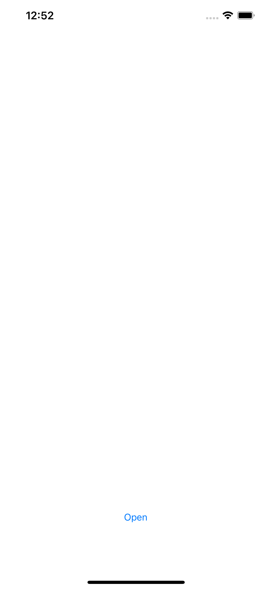
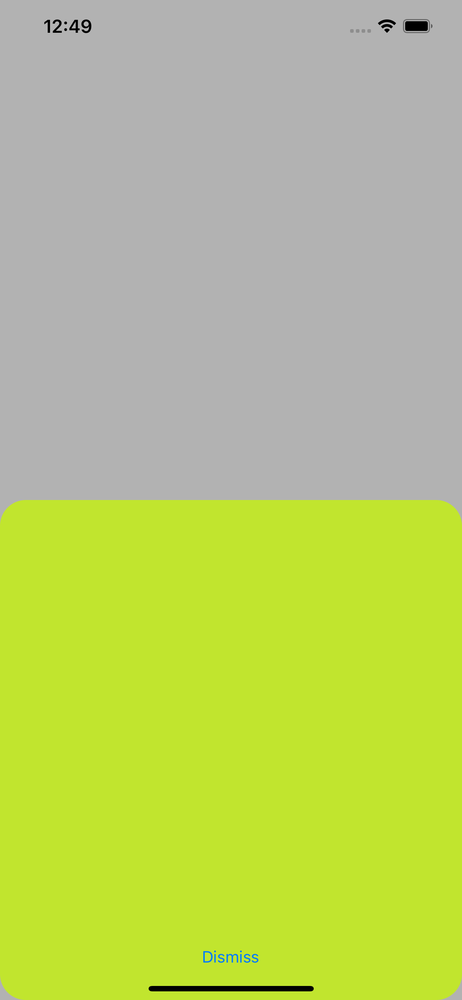
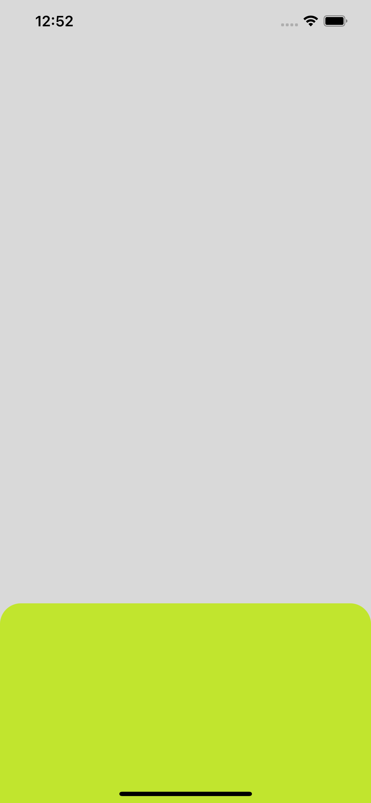

# InterruptibleTransition

Пример для статьи [Всплывай! Транзишены в iOS](
 https://habr.com/ru/company/dodopizzaio/blog/463527/)
 
В проекте:
- анимированные переходы между экранами
- работа с UIPresentationController
- интерактивное закрытие и [отображение](https://github.com/SergLam/InterruptibleTransition/tree/interactivePresentation) контроллера

<h4>Демо скриншоты<h4>

 
